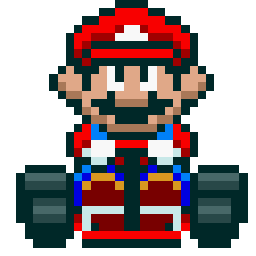
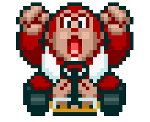
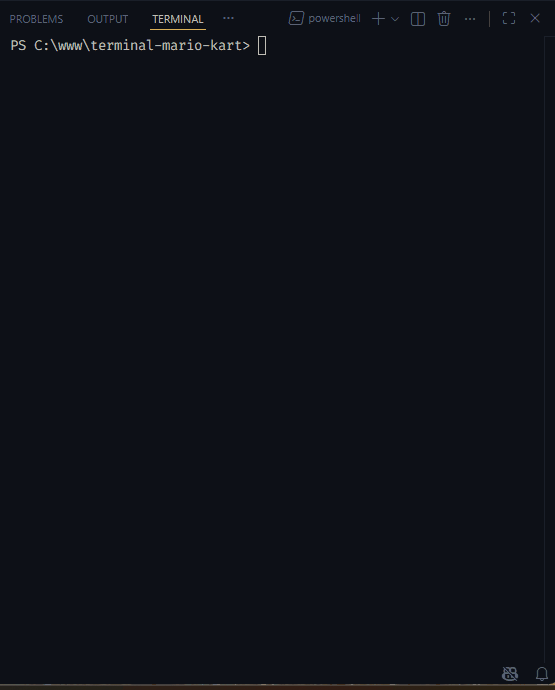

# 🏎️ Terminal Mario Kart


[](https://github.com/itsmevictorhugo/terminal-mario-kart/actions)


Simulador de corridas inspirado em **Mario Kart**, executado diretamente no terminal com interface interativa, animações e sistema de ranking..

Projeto evoluído a partir do desafio proposto por **[Felipe Aguiar](https://github.com/felipeAguiarCode)** no **Bootcamp de Node.js** na [DIO.me](https://web.dio.me/track/jornada-para-o-futuro), com diversas melhorias de arquitetura, UX e funcionalidades.


# 🎯 Objetivo do Projeto

<table>
      <tr>
          <td>
              
          </td>
          <td>
              <b>Objetivo:</b>
              <p>Mario Kart é uma série de jogos de corrida desenvolvida e publicada pela Nintendo. O objetivo inicial era criar uma lógica simples para simular corridas considerando regras de atributos e sorte.</p>
          </td>
      </tr>
  </table>

<h2>Players</h2>
      <table style="border-collapse: collapse; width: 800px; margin: 0 auto;">
        <tr>
            <td style="border: 1px solid black; text-align: center;">
                <p>Mario</p>
                
            </td>
            <td style="border: 1px solid black; text-align: center;">
                <p>Velocidade: 4</p>
                <p>Manobrabilidade: 3</p>
                <p>Poder: 3</p>
            </td>
             <td style="border: 1px solid black; text-align: center;">
                <p>Peach</p>
                
            </td>
            <td style="border: 1px solid black; text-align: center;">
                <p>Velocidade: 3</p>
                <p>Manobrabilidade: 4</p>
                <p>Poder: 2</p>
            </td>
              <td style="border: 1px solid black; text-align: center;">
                <p>Yoshi</p>
                
            </td>
            <td style="border: 1px solid black; text-align: center;">
                <p>Velocidade: 2</p>
                <p>Manobrabilidade: 4</p>
                <p>Poder: 3</p>
            </td>
        </tr>
        <tr>
            <td style="border: 1px solid black; text-align: center;">
                <p>Bowser</p>
                
            </td>
            <td style="border: 1px solid black; text-align: center;">
                <p>Velocidade: 5</p>
                <p>Manobrabilidade: 2</p>
                <p>Poder: 5</p>
            </td>
            <td style="border: 1px solid black; text-align: center;">
                <p>Luigi</p>
                
            </td>
            <td style="border: 1px solid black; text-align: center;">
                <p>Velocidade: 3</p>
                <p>Manobrabilidade: 4</p>
                <p>Poder: 4</p>
            </td>
            <td style="border: 1px solid black; text-align: center;">
                <p>Donkey Kong</p>
                
            </td>
            <td style="border: 1px solid black; text-align: center;">
                <p>Velocidade: 2</p>
                <p>Manobrabilidade: 2</p>
                <p>Poder: 5</p>
            </td>
        </tr>
    </table>

--- 
### Este projeto evoluiu para uma aplicação CLI completa com:
- Arquitetura modular
- Interface interativa
- Sistema de ranking
- Modos de jogo
- Testes automatizados

---

# 🚀 Funcionalidades

- ✅ CLI interativa
- ✅ Seleção de modos de jogo
- ✅ Corrida 1x1
- ✅ Campeonato completo
- ✅ Sistema de ranking
- ✅ Animações no terminal
- ✅ Interface colorida com Chalk
- ✅ Spinner de corrida com Ora
- ✅ Validação de entrada do usuário
- ✅ Arquitetura modular
- ✅ Testes automatizados com Vitest

---

# 🕹️ Modos disponíveis

- Corrida 1x1
- Campeonato (todos contra todos)
- Ver Ranking
- Sair

---

# 🧠 Mecânicas do jogo

- Corridas com 5 rodadas

- Tipos de pista aleatórios:
  - 🟦 Reta → usa Velocidade
  - 🟨 Curva → usa Manobrabilidade
  - 🟥 Confronto → usa Poder

- Dados de 6 lados

- Sistema de pontos

- Pontuação nunca negativa

- Vitória por maior pontuação


---

## 🎮 Demonstração



---


# 📦 Instalação

```bash
git clone https://github.com/itsmevictorhugo/terminal-mario-kart.git

cd terminal-mario-kart

npm install
```

---

# ▶️ Executar

```bash
node index.js
```

---

# 🧪 Testes

Executar todos os testes:

```bash
npm test
```

Testes implementados com **Vitest**.

Para executar os testes em modo contínuo (watch):

```bash
npm run test:watch
```

Para gerar relatório de cobertura de código:

```bash
npm run coverage
```

O relatório será gerado na pasta:

```
coverage/index.html
```

A cobertura atual do projeto está acima de **80%**, garantindo boa confiabilidade das regras de negócio.

---

# 🔄 Integração Contínua (CI)

O projeto possui pipeline de integração contínua utilizando **GitHub Actions**.

A cada push ou pull request:

- Instala dependências
- Executa testes automatizados
- Gera relatório de cobertura de código

Isso garante qualidade e estabilidade da aplicação.

---

# 🏗️ Arquitetura

```
├── src/
│   ├── data/
│   │   └── players.js
│   │
│   ├── engine/
│   │   ├── championship.js
│   │   ├── raceEngine.js
│   │   └── ranking.js
│   │
│   ├── ui/
│   │   └── terminalUI.js
│   │
│   ├── utils/
│   │   ├── logger.js
│   │   └── random.js
│   │
│   ├── cli.js
│   └── main.js
│
├── tests/
│   ├── players.test.js
│   ├── raceEngine.test.js
│   └── ranking.test.js
│
├── .gitignore
├── index.js
├── package.json
├── README.md
└── LICENSE
```

Separação por responsabilidades:

- CLI → interação
- Engine → regras de negócio
- UI → terminal
- Data → entidades
- Utils → utilidades
- Tests → validação

---

# 🧩 Tecnologias

- Node.js
- Inquirer
- Chalk
- Ora
- Vitest

---

# 📈 Evoluções em relação ao projeto original

Melhorias implementadas:

- Arquitetura modular
- Interface colorida
- Sistema de ranking
- Modo campeonato
- Validação robusta de inputs
- UX melhorada
- Código desacoplado
- Organização profissional de pastas
- Separação de responsabilidades
- Estrutura escalável
- Cobertura de testes automatizada
- Integração contínua com GitHub Actions
- Pipeline de validação automática
- Monitoramento de qualidade de código

---

# 🎓 Aprendizados

- Programação orientada à lógica
- Arquitetura de projetos Node CLI
- Clean Code
- Testes automatizados
- UX em terminal
- Uso de bibliotecas externas
- Modularização
- Design de sistemas simples

---

## 📄 Licença

Este projeto está sob a licença MIT — veja o arquivo [LICENSE](./LICENSE) para detalhes.

---

## 👨‍💻 Autor

**Victor Hugo**  
🔗 https://github.com/itsmevictorhugo